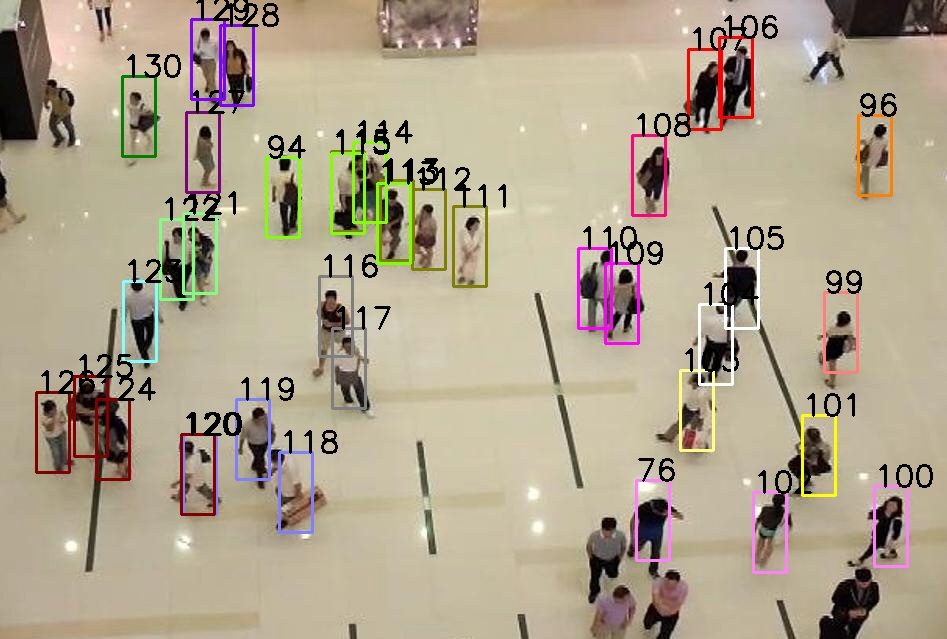
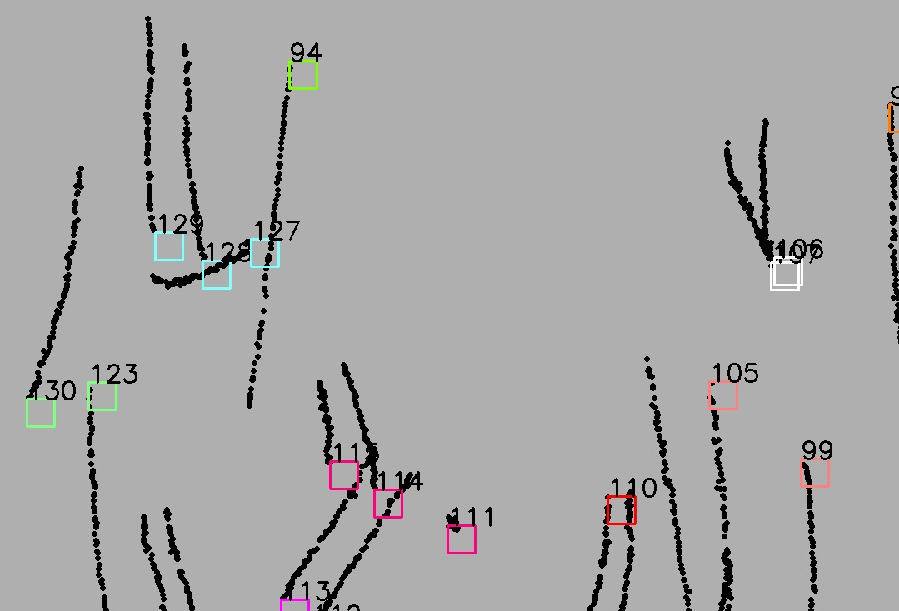
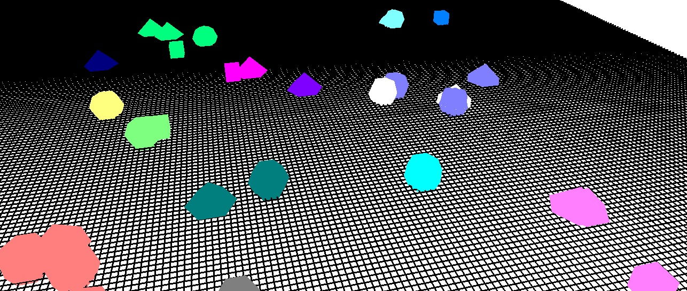

# t1-fcg
Trabalho da disciplina de Fundamentos de Computação Gráfica de 2017/I do curso de Ciência da Computação da PUCRS.

## Camera view 

- Bouding rectangle
- Id displaying
- Grouping identification as bounding rectangle's color 

## World view

- Bouding rectangle
- Id displaying
- Grouping identification as bounding rectangle's color
- Trajectories

## 3D view

- OpenGL's 3D objects
- Grouping identification as object's color 

